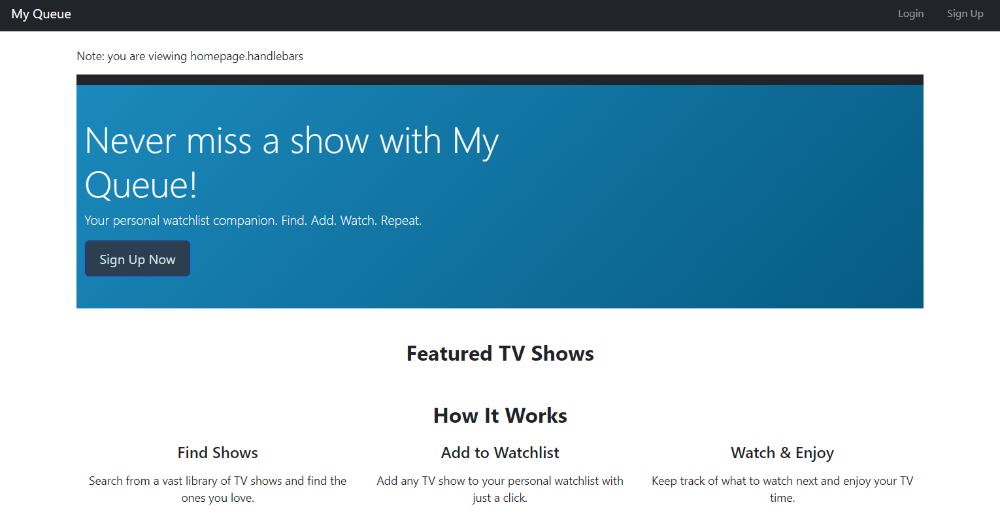
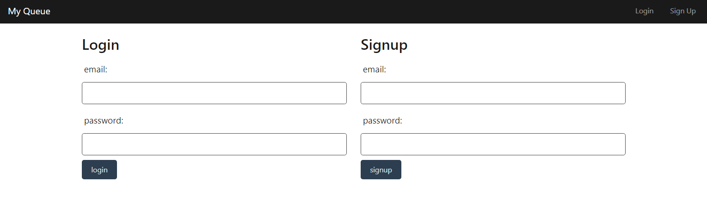
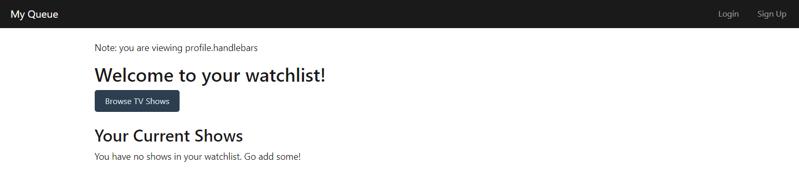
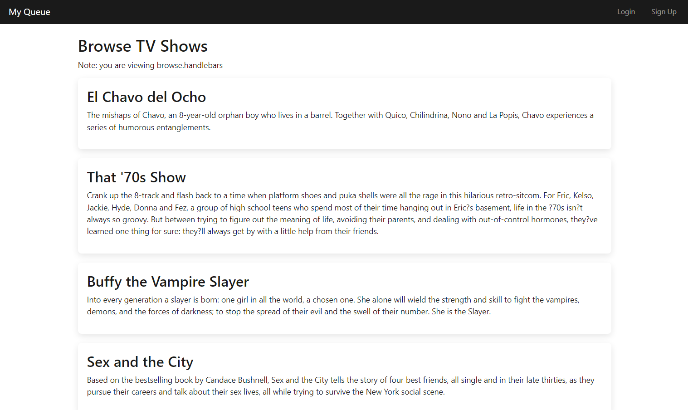

# Show-Watchlist
## Description
A full-stack application that is perfect for finding new shows to watch,   
adding them to a watch list, and viewing other users' comments about the show.   

## Badges

## Table of Contents
- [Description](#description)
- [Screenshots](#screenshots)
- [Usage](#usage)
- [What We Have Learned](#what-we-have-learned)
- [Credits](#credits)
- [Licenses](#licenses)
 

## Screenshots
----Home Page----

----Login Page----

---Watchlist Page---

----Browsing----

## Usage
Simply click on the link and watch the magic happen.    
Link to the website: https://my-queue-proj2-17f6449399b4.herokuapp.com  

## What We Have Learned
We've learned about full-stack application creation, with regards to  
frontend (Views: using .handlebars, setting up public/css styling and  
public/js functions) and backend (Models: creating relationships  
between tables and values, Controllers: managing /api routes that execute actions  
and base routes that render .handlebar pages, and seeds to seed SQL database).  
Getting everything in working order and more, was a difficult task in of itself.  
Moving forward, we're more confident in our abilities to create these more  
detailed applications for future projects.  

## Credits
Made by Aeryk Andrews, Allie Stewart, Chris Valada, and Devan Capps.  

## Licenses
Please refer to the LICENSE in the repository.  
